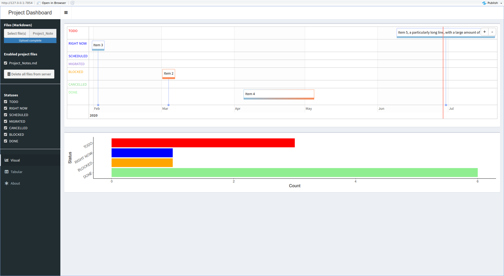

# Dissertation Project Management Intro

## General ideas

### Four major elements around which to build manage a large project

- Task dependency / hierarchy
- Task statuses
- Remembering when a task needs to be done
- Remembering when to start working on a task

### Goals to keep in mind for facilitating storing and using knowledge about tasks

- Notes should ideally be organized alongside related notes
- Notes should ideally be able to be easily re-compiled alongside _unrelated_ notes
- Notes should allow one to understand the timeline of how and when decisions happened

## Tools

### Visual Studio Code + RStudio

This approach provides a dashboard, written in R:

#### Setup

1. Download these files:
   1. Click `Clone -> Download ZIP`.
      
   1. Un-zip the downloaded archive.
1. Create a copy of `Project_Notes_Example.md`, and call it `Project_Notes.md`. **This will be the file you use as your global Todo list.**

1. Install [Visual Studio Code](https://code.visualstudio.com/) ("VSCode") for your Operating System.
1. Install the "`org-checkbox`" extension:
   1. Open VSCode.
   1. In VSCode, type `Cmd/Ctrl + Shift + P`, then "`Extensions: Install Extensions`", and press Enter.
   1. In the Extensions sidebar that pops up, type "`org-checkbox`". You should see one by `publicus`. Click "Install".
1. Install [RStudio](https://rstudio.com/products/rstudio/download/) for your Operating System.

#### Open this directory in VSCode

1. Open VSCode
1. Click `File -> Open Workspace...`
1. Navigate to and select this directory.

##### VSCode keyboard shortcuts

###### Using the interface

| Function          | Keyboard Shortcut | Command Palette (`⌘ + Shift + P`) command |
| ----------------- | ----------------- | ----------------------------------------- |
| Show/Hide sidebar | `⌘ + B`           | `View: Focus into Sidebar`                |
| Fold              | `⌥ + ⌘ + [`       | `Fold`                                    |
| Unfold            | `⌥ + ⌘ + ]`       | `Unfold`                                  |

###### Editing files:

| Function                   | Keyboard Shortcut | Command Palette (`⌘ + Shift + P`) command |
| -------------------------- | ----------------- | ----------------------------------------- |
| Find                       | `⌘ + F`           | `Find`                                    |
| Replace                    |                   | `Replace`                                 |
| Find all (across files)    | `⌘ + Shift + F`   | `Search: Find in Files`                   |
| Replace all (across files) | `⌘ + Shift + h`   | `Search: Replace in Files`                |

###### Command Palette functions

| Function                                    | Keyboard Shortcut | Command Palette prefix |
| ------------------------------------------- | ----------------- | ---------------------- |
| Run command                                 | `⌘ + Shift + P`   | `>`                    |
| Search for and open a file in the directory | `⌘ + P`           | `(no prefix)`          |

#### Open the Dashboard in RStudio

1. Open [`dashboard/dashboard.Rproj`](dashboard/dashboard.Rproj) using RStudio:
   1. Open RStudio
   1. In RStudio, click `File -> Open Project...`.
   1. Navigate to and select `dashboard.Rproj`.
1. In RStudio, open [`dashboard/dashboard.Rmd`](dashboard/dashboard.Rmd), with `File -> Open File...`
1. _(Only necesssary the first time you run the Dashboard)_ In the RStudio R console, run `renv::restore()` to install extensions that the Dashboard needs.
      - If you are on MacOS and see an error, "`ld: library not found for -lgfortran`", you may need click `Tools -> Terminal -> New Terminal...`, and run `xcode-select --install` to install [XCode](https://developer.apple.com/xcode/ide/) on your system. (This is to be tried after following any directions in the error message.)
1. Click the "`Knit`" button, or click `File -> Knit Document`.

### OpenProject

This approach uses [OpenProject](https://www.openproject.org/), which is open-source Project Management software for ["Agile" Project Management](https://www.atlassian.com/agile/project-management/epics-stories-themes).

#### Setup

1. Install [`docker-compose`](https://docs.docker.com/compose/install/#install-compose) for your Operating System.
1. Install [Visual Studio Code](https://code.visualstudio.com/) for your Operating System.

#### Start and open OpenProject

1. Run `start.sh`
1. Wait a few minutes, then go to http://localhost:8080/ in your web browser.
1. Sign in with username `admin` and password `admin`. You will be asked to create a new password.

### Additional reference material

- [Introduction to **Markdown**](https://guides.github.com/features/mastering-markdown/)
- [`org-checkbox` VSCode extension key](https://raw.githubusercontent.com/publicus/project-management-starter/master/key.md)
